# Create Web App from Docker Container in Azure

**There are 5 objectives with this lab:**
* Start Cloud Shell
* Set Resource Variables in Cloud Shell
* Create a New Container Registry
* Build an Image and Push to ACR
* Create and Deploy a New Web App

## Start Cloud Shell

Once again I want to start this lab off by saying I didn't know how to do this lab at all so I resorted to watching the walkthrough and go through the text guide. All the commands are sourced from the walkthrough but I chose to modify them and explain each part of the command so show full understanding of whats happening. So with that being said, lets start this lab!

In the first part of the lab, we'll need to get the Azure Cloud Shell up and running. No walkthrough. We've done this before. Use Bash and make sure the location matches the location of the storage account in your resource group (RG) though. 

Once your Cloud Shell is up,  that completes the first objective of this lab! On to objective 2. 

## Set Resource Variables in Cloud Shell

For the second portion of this lab, we have to create variables for both my resource group and the name of my container registry since we'll need to refer to these values in the following commands. I named my variables `ACR` and `RG`, respectively.  You can check to see if the variables were created properly by using the `echo` command

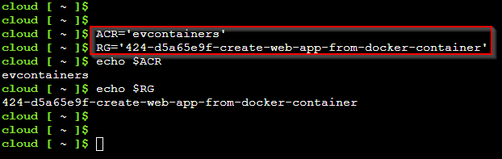

That completes the second objective. Lets move to the 3rd one. 

## Create a New Container Registry

Lets create the registry. We're going to be using the Azure Container Registry (ACR) CLI commands so please refer to ([this website](https://learn.microsoft.com/en-us/cli/azure/acr?view=azure-cli-latest)) for the create and build commands. For the create command, it's the same as the last lab pretty much so `az acr create --resource-group $RG --name $ACR --sku Basic --admin-enabled true`. If you want a breakdown of this command, visit the Docker container lab in my repository. 

The command will look something like this in Bash:

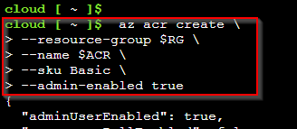

I'm making use of the `\` character to make the commands easier to read. Hopefully it helps. 

You can go to the All Resources page to make sure the ACR was deployed.

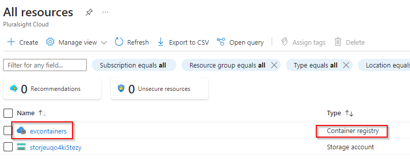

Now we're done with Objective 3. Lets move on to objective 4.

## Build an Image and Push to ACR

We have to build the repository use the build command but first, we need to get all of materials. So in the last lab, we created the Docker file ourselves. This time, we're going to use a GitHub branch that has all the files we want for our Web App and create a repository that way. So the first thing we need to do switch to our `clouddrive` directory. You can do `cd clouddrive` in the Azure Cloud Shell to get here. 

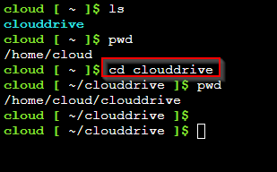

Now, the lab is instructing us to clone one of the GitHub branches and put it here in the Azure Cloud Shell. The command is `git clone --branch js-docker https://github.com/linuxacademy/content-AZ-104-Microsoft-Azure-Administrator.git /home/cloud/clouddrive/js-docker`. Lets break it down.

The `git clone` command just utilizes the Git CLI commands and we're basically taking the exact branch that's on the GitHub URL and putting those files in our Cloud Shell. Think of it as a download. `--branch js-docker` specifies the specific branch to download. This website has three and `js-docker` is one of them. We have to provide the GitHub website so that is where the URL comes into play. That last portion specifies WHERE to put the branch downloads so we're making a new directory under `clouddrive` that has the name `js-docker`. All the files should be here. 

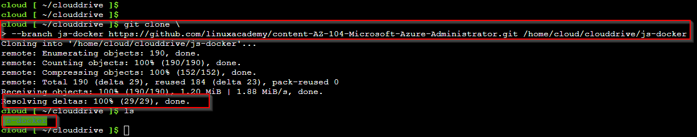

You can then use the `ls` Linux command to see all the files that were on the website branch are now in the `js-docker` directory that we just created (first you have to change to the directory though). We'll use the Dockerfile that is here to create our repository in the ACR build command. 

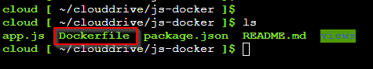

Now, lets build the repository. This command looks the same as the previous lab so I won't break it down: `az acr build --registry $ACR --image rockstarev/webappcontainer:v1.0.1 --file Dockerfile .`

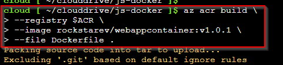

Go to your resources and your new repository should be there. 

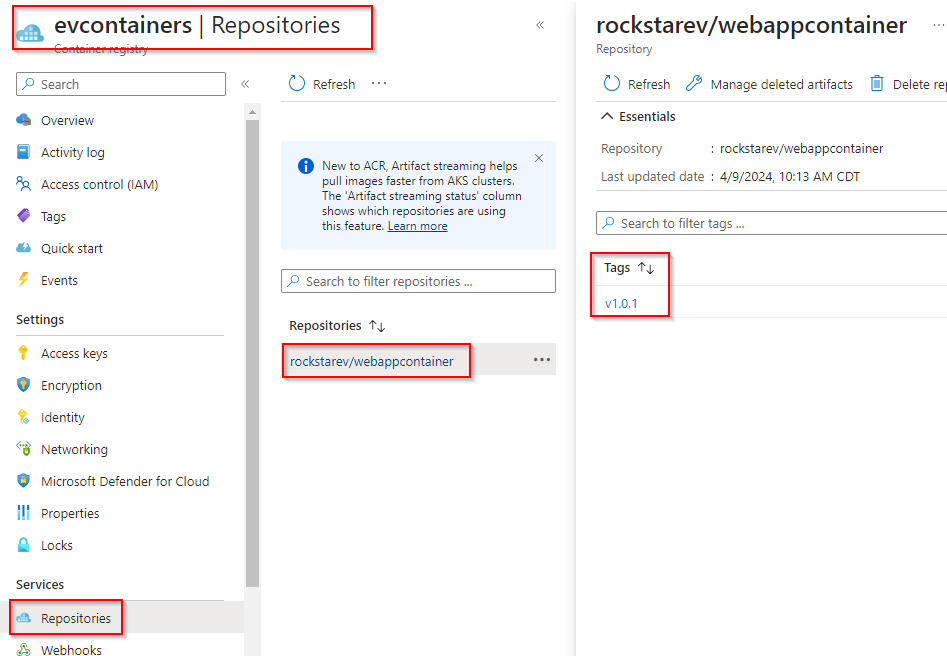

On to the final portion of this lab.

## Create and Deploy a New Web App

Now we need to actually create the Web App that will host our container. So, serch for App Services in the portal search bar. 

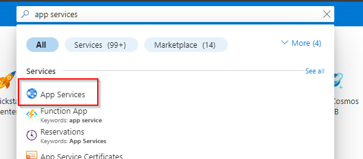

Once here, click on `+ Create` and choose `+ Web App`. 

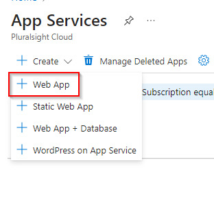

Follow the prompt. Make sure you choose your resource group and give your Web App a unique name. Choose the Container option for Publish since we'll be using the container we just created. Make sure the region matches the region of your other resources. 

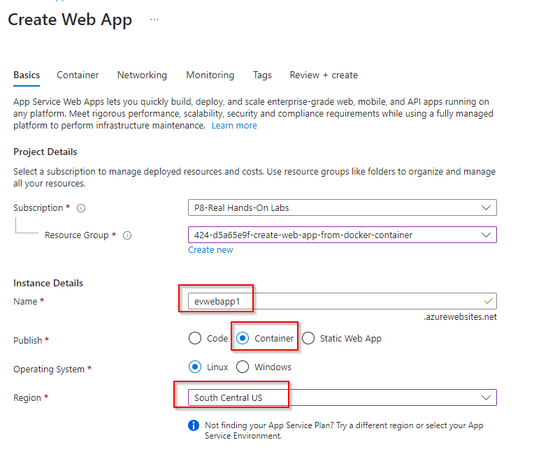

We were instructed to choose the Standard S1 pricing plan so I switched to that one. Now, lets go to the Container tab of this deployment. 

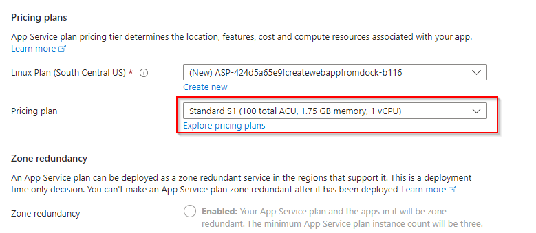

Now, we need to choose Azure Container Registry for our Image Source. We'll also use Single Container for our options since we're only pulling the code from one container. The rest of the information should automatically populate since we only have one container and one version. Review and create. 

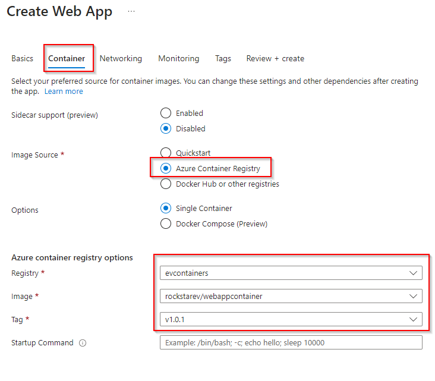

Once the Web App is deployed, go to the resoure overview and click on the Default domain to get the URL for the Web App. 

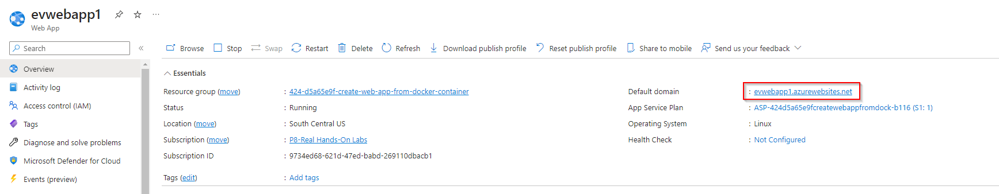

Copy and paste this into your URL and you should get the text from your container!

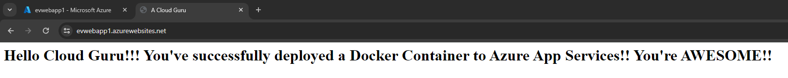

Lab completed!

## Personal Notes

I also didn't understand this lab the first time I did it and had to look at the guide BUT after going through the last ACR lab meticulously, I understand majority of what's happening now. The Azure App Services is a PaaS that allows you to deploy applications without dealing with the underlying infrastructure. In our case, we're doing Web Apps so it allows us to create the contents of a web page (HTML and CSS) and be given a URL without having to do a bunch of extra work (DNS, networking, SSL, etc). With that being said, how does a container make any of this easier? 

Well, the source of this web page is a `home.pug` file that has all of our website text in a suitable HTML and CSS format. It uses Express and something else to make this website easy to deploy. Now, this home.pug file and extension is run using node.js. The file that runs this code on GitHub is called app.js. Someone created these files for this lab. The app.js file runs off of the node.js and npm (node.js package manager?) softwares. How do we get those softwares? We get them through our container that is running a Linux image (CentOS) that can run those two softwares. How do we know which versions of those node.js and npm softwares to run? We have a package.json file that the Dockerfile references when it's being told to install node.js and npm. 

Now do I know all of the specifics and what each part of the app.js and home.pug files mean? I don't understand the syntax. I don't understand all of the Docker syntax. But these all work together to easily create a website. 

Recap, the Web App can host the docker file which is instructed to install an OS (CentOS) that can handle the instruced node.js and npm packages that can run the app.js file which is able to efficiently read the home.pug file. Thats the  point of this lab. 
